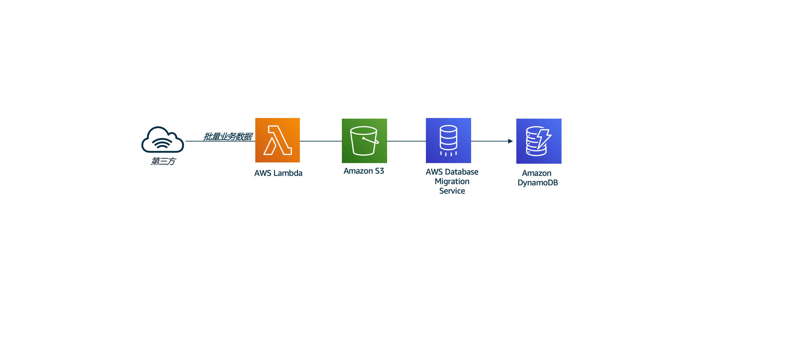

# 实验1: DMS+DynamoDB+S3 数据摄取

## 场景

在实验1中，我们模拟批量的已有数据导入，使用`lambda`从互联网下载电影数据集，将其存放在`S3`，然后将使用`DMS`将数据加载到`Dynamo DB`。在企业中，类似的数据可能已经存在于某些RDS，NoSQL或数据仓库系统中。可以一次性将数据作为批处理或实时数据流摄取。

## 架构图

## 代码清单

实验1涉及到的代码清单如下：

- CloudFormation: 

  使用CloudFormation创建如下资源：

  1. Amazon S3存储桶，用于保存movielens数据。
  2. 提供访问数据库迁移服务的权限的IAM角色，以访问和供应其他AWS资源
  3. VPC，子网，Internet网关和安全组以支持DMS复制实例工作。
  4. DMS复制实例和DMS任务
  5. Lambda-1将电影数据从外部源复制到帐户的S3存储桶中。
  6. Lambda-2函数启动DMS任务复制。

  其中

  > cfn-scripts 为中国区的CloudFormation模版
  >
  > cfn-scripts-global 为Global的CloudFormation模版

- 模拟数据集：

  > data/initial-load

- DMS Task：

  > DMS task.json

