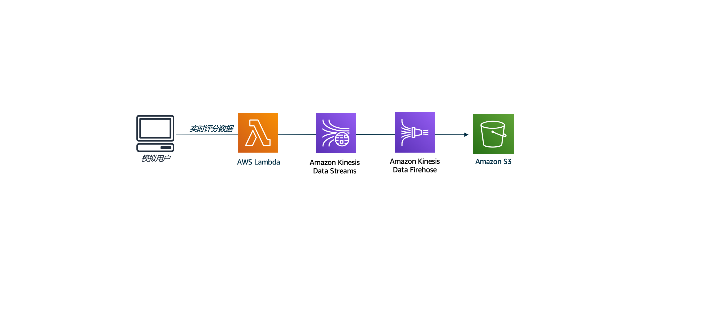

# 实验2: Kinesis接入实时数据流
## 场景
在实验2中，将创建一个lambda函数生成实时的数据，模拟真实业务中流式的数据想数据湖加载。lambda生成的数据将首先经过kinesis data stream，再经过kinesis dara Firehose，之后到达S3

## 架构图

## 代码清单
- 使用lambda来模拟爬取电影信息，然后接入Kinesis
> lambda_crawlyer.py