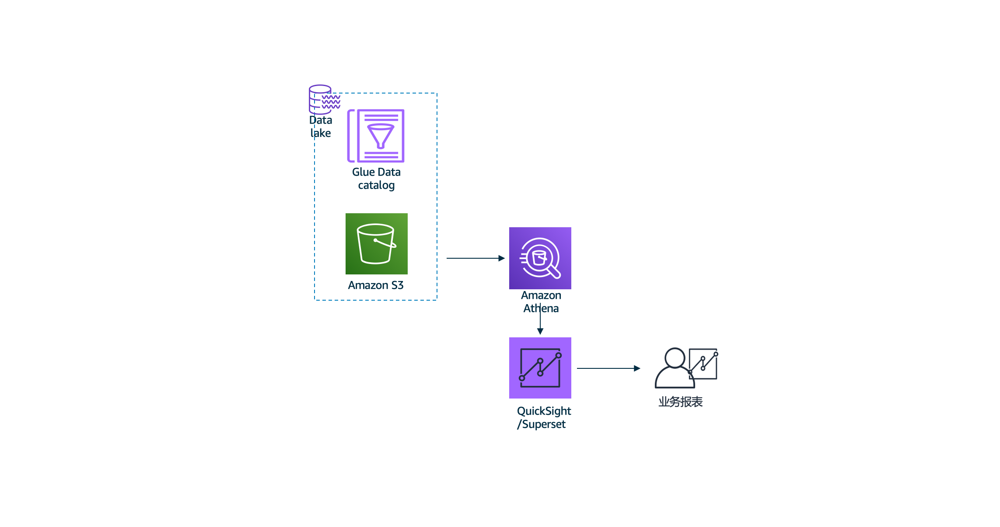

# 实验4: 利用Athena+Superset做数据可视化
## 场景
结合不同的行业或业务，会在实际需求中定义不同的举足轻重的业务指标，将他们可视化为业务报表以遍业务人员，决策人员进行优化业务的判断，在这里，我们实验superset和Athena搭建可视化报表。
> 因为在中国区QuickSight还没有launch，所以使用开源的Superset来做可视化。
## 架构图

## 代码清单
实验4利用Athena和SuperSet在控制台操作，无代码。