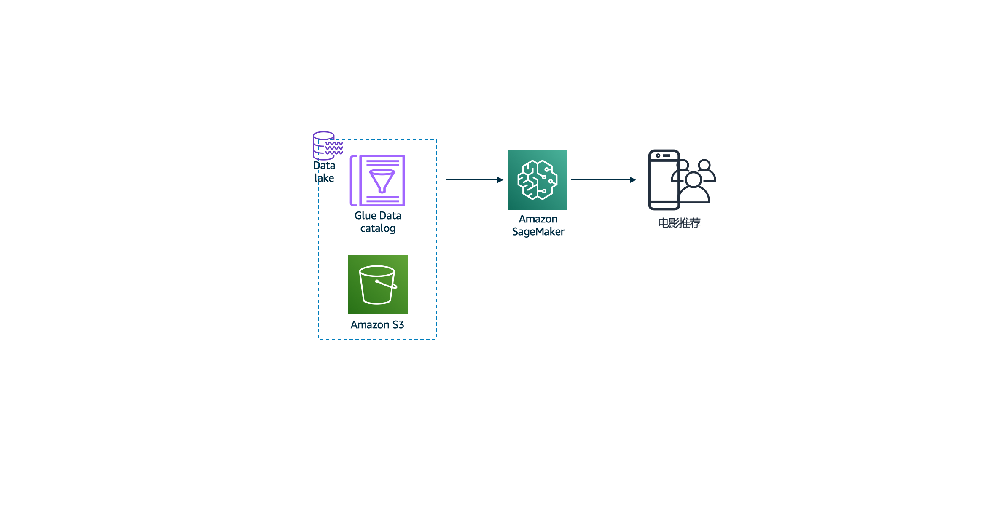

# 实验5: 利用Sagemaker实现电影推荐
## 场景
在实验5中，使用Sagemaker的Jupyter notebook组件进行模型训练和推理，最终实现电影推荐模型的API对外服务。
## 架构图

## 代码清单
- Sagemaker Jupyter Notebook初始化脚本
> sagemaker_helper.sh
- Sagemaker Jupyter Notebook
> Movie_Recommender_Lab5_cn.ipynb