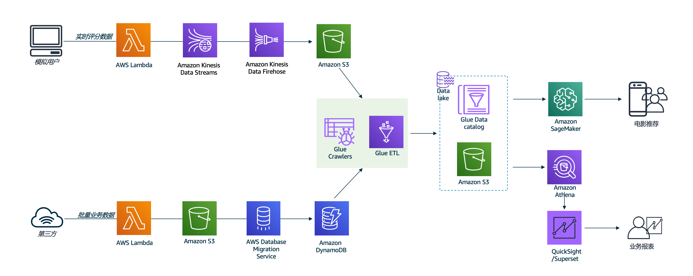

# 概述

​    AWS合作伙伴数据分析动手训练营，面向AWS中国区合作伙伴，赋能合作伙伴架构师通过使用AWS的数据分析服务，进行结构化和非结构化数据的摄取、存储、转换、分析。为合作伙伴的解决方案架构师提供了一天的动手实验，包括了Amazon Kinesis，AWS Glue，Amazon Athena和Amazon SageMake等服务。详情可参看：http://gcr-bigdata-demo-prod.s3-website-ap-northeast-1.amazonaws.com/0-introduction.html 。

​    本代码仓库包含了动手训练营动手的相关代码。

# 数据分析动手训练营大纲

​     整个Workshop，以数据分析和机器学习的负载不同，分为了5个环节，对应5个动手实验，帮助参与者构建一个完整电影推荐方案，包含数据爬取，存储，分析，处理，展现 以及利用机器学习做智能推荐的完整流程。

完整的架构图如下：

### 

#### [实验1](https://github.com/readybuilderone/partner-bigdataworkshop-materials/tree/main/Lab1) 

对应：http://gcr-bigdata-demo-prod.s3-website-ap-northeast-1.amazonaws.com/2-%E6%95%B0%E6%8D%AE%E6%91%84%E5%8F%96%E4%B8%8E%E5%AD%98%E5%82%A8/2_4-%E5%AE%9E%E9%AA%8C1.html 

从互联网上的外部来源获取电影数据集，将其存放在S3作为原始数据层，然后将其加载到Dynamo DB。在企业中，类似的数据可能已经存在于某些RDS，NoSQL或数据仓库系统中。可以一次性将数据作为批处理或实时数据流摄取。

#### 实验2

对应：http://gcr-bigdata-demo-prod.s3-website-ap-northeast-1.amazonaws.com/2-%E6%95%B0%E6%8D%AE%E6%91%84%E5%8F%96%E4%B8%8E%E5%AD%98%E5%82%A8/2_5-%E5%AE%9E%E9%AA%8C2.html

根据具体的需求用例，可能需要同时进行批处理和流处理，或者仅需要进行批处理或流处理。本实验将使用DMS一次性将一个完整的数据加载到Dynamo DB中，然后使用Lamda函数作为源数据生成模拟器将新记录传输到Kinesis流中以模拟流数据加载。

#### 实验3

对应：http://gcr-bigdata-demo-prod.s3-website-ap-northeast-1.amazonaws.com/3-%E6%95%B0%E6%8D%AEetl/3_4-%E5%AE%9E%E9%AA%8C3.html

在本实验中，您将使用Glue数据目录在S3和DynamoDB中存储的数据上定义架构。参与者对数据执行ETL，以准备将其用于机器学习和可视化。

#### 实验4

对应：http://gcr-bigdata-demo-prod.s3-website-ap-northeast-1.amazonaws.com/4-%E6%95%B0%E6%8D%AE%E5%88%86%E6%9E%90%E4%B8%8E%E5%8F%AF%E8%A7%86%E5%8C%96/4_3-%E5%AE%9E%E9%AA%8C4.html

结合不同的行业或业务，会在实际需求中定义不同的举足轻重的业务指标，将他们可视化为业务报表以遍业务人员，决策人员进行优化业务的判断，在这里，我们实验superset和Athena搭建可视化报表。

#### 实验5

对应：http://gcr-bigdata-demo-prod.s3-website-ap-northeast-1.amazonaws.com/4-%E6%95%B0%E6%8D%AE%E5%88%86%E6%9E%90%E4%B8%8E%E5%8F%AF%E8%A7%86%E5%8C%96/4_4-%E5%AE%9E%E9%AA%8C5.html

本实验将使用Amazon Sagemaker进行模型训练和推理。

## 架构图

pass

## 模块

pass

# References

